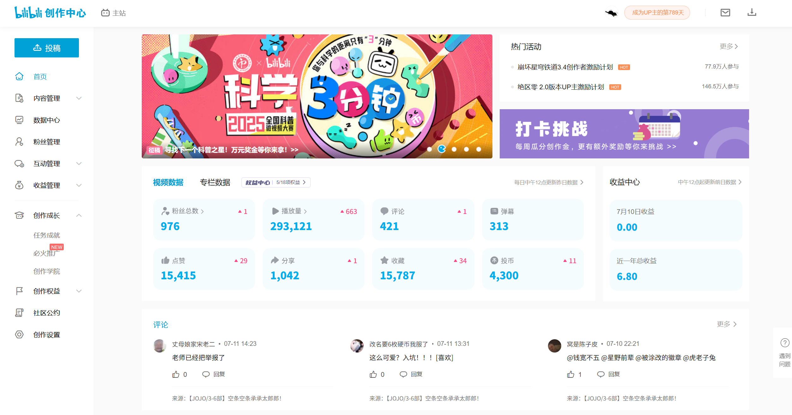

#### **已有项目部分总结**

**更新日期：** 2025年7月11日

---
**实习经历：**

**一、 结合RAG的智能校园论坛网页开发（东方瑞通公司）**

*   **项目名称：** [知启AI校园-基于AI的智能问答论坛]
*   **项目简介：**
    *   [技术栈：Vue+SpringBoot+MySQL+Milvus等，集成LangChain实现基于语义搜索的智能问答。]
    *   [实现主页、帖子列表等主要页面的前端搭建，整理、连接、测试与优化所有项目的前端页面，并开发连接前后端的接口、调试数据传输；实现千帆大模型API对接与学习路径生成模块。]
*   **获得荣誉：** [在项目评定中，团队项目获得三等奖，个人获得最佳产品经理称号。]

---
**信息精选：**
*   **2024CICA48h游戏开发大赛：**
**镜笼：https://www.bilibili.com/video/BV1HihmekERi/?spm_id_from=333.1387.favlist.content.click&vd_source=152c6987f0806eb753af5ee03039c428**

*   **Bilibili up主主页：**
*   
**榛子香草冰：[https://space.bilibili.com/545759400?spm_id_from=333.40164.0.0](https://space.bilibili.com/545759400?spm_id_from=333.40164.0.0)**

